<div align="center">

# ❤️ Heart Disease Risk ML Platform

### Production-ready machine learning platform for heart disease risk prediction using PCA, model comparison, FastAPI inference APIs, Docker, automated testing, and CI/CD workflows.

<p>
  
  
  
</p>

<p>
  
  
  
</p>

<p>
  
  
  
</p>

<p>
  <a href="#-overview">Overview</a> •
  <a href="#-features">Features</a> •
  <a href="#-tech-stack">Tech Stack</a> •
  <a href="#-screenshots">Screenshots</a> •
  <a href="#-architecture">Architecture</a> •
  <a href="#-quick-start">Quick Start</a> •
  <a href="#-api-reference">API</a> •
  <a href="#-troubleshooting">Troubleshooting</a>
</p>

</div>

---

## 📌 Overview

**Heart Disease Risk ML Platform** is a production-oriented modernization of a Master's degree PCA project built on the Cleveland Heart Disease dataset.

The platform predicts whether a patient record indicates possible heart disease risk using clinical indicators such as age, chest pain type, resting blood pressure, cholesterol, fasting blood sugar, ECG results, maximum heart rate, exercise-induced angina, ST depression, slope, number of vessels, and thalassemia category.

---

## ✨ Features

<table>
<tr>
<td width="33%" valign="top">

### 🩺 Clinical Analytics

- Cleveland heart disease dataset
- Clinical feature exploration
- Correlation heatmap
- Age group analysis
- Chest pain analysis
- Heart-rate analysis
- Target distribution review
- Preserved research plots

</td>
<td width="33%" valign="top">

### 🤖 Machine Learning

- Binary risk classification
- PCA dimensionality reduction
- Logistic Regression baseline
- PCA + Logistic Regression
- Random Forest classifier
- PCA + Gradient Boosting
- ROC-AUC based model selection
- Confusion matrix and ROC curve

</td>
<td width="33%" valign="top">

### 🚀 Engineering

- FastAPI inference API
- Swagger/OpenAPI documentation
- Package-based `src/` structure
- VS Code execution scripts
- Docker and Docker Compose
- GitHub Actions CI
- Pytest test suite
- MIT License

</td>
</tr>
</table>

---

## 🧱 Tech Stack

<div align="center">

<table>
<tr>
<td align="center" width="25%">
<br/>
<b>Python</b><br/>
Core Language
</td>

<td align="center" width="25%">
<br/>
<b>FastAPI</b><br/>
Inference API
</td>

<td align="center" width="25%">
<br/>
<b>Scikit-Learn</b><br/>
ML Pipelines
</td>

<td align="center" width="25%">
<br/>
<b>Pandas</b><br/>
Data Processing
</td>
</tr>

<tr>
<td align="center">
<br/>
<b>PCA</b><br/>
Feature Engineering
</td>

<td align="center">
<br/>
<b>Pytest</b><br/>
Testing
</td>

<td align="center">
<br/>
<b>GitHub Actions</b><br/>
CI/CD
</td>

<td align="center">
<br/>
<b>Docker</b><br/>
Containerization
</td>
</tr>

</table>

</div>

---

## 📸 Screenshots

### Platform Screenshots

<p align="center">
  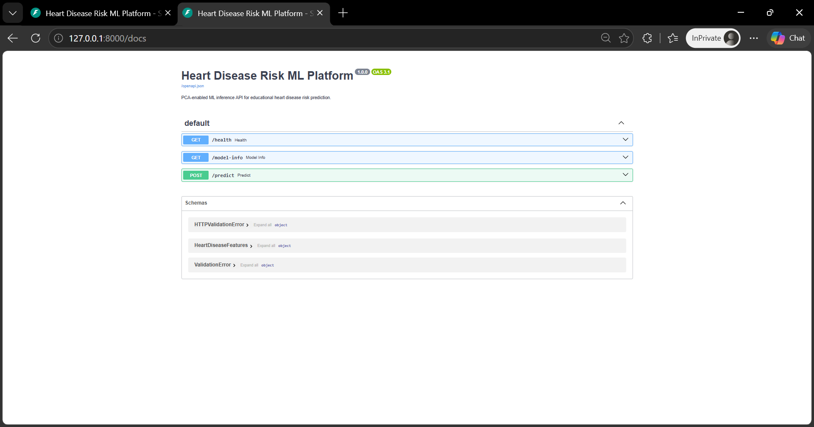
  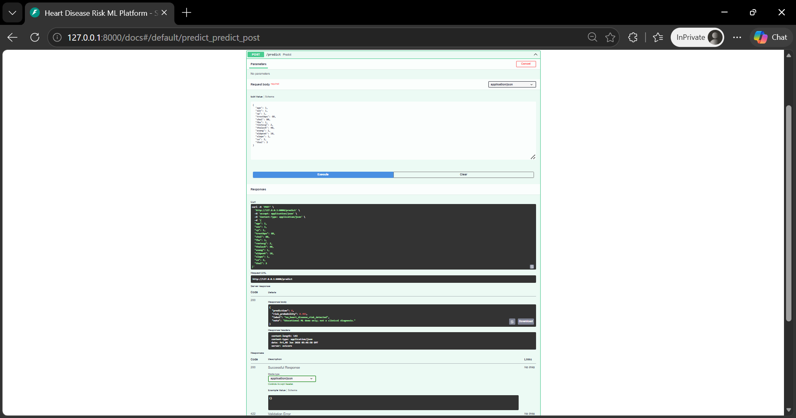
</p>

<p align="center">
  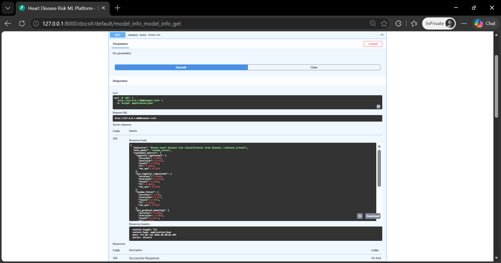
  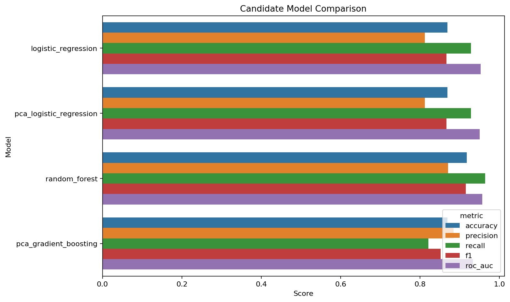
</p>

### PCA & Machine Learning Analysis

<p align="center">
  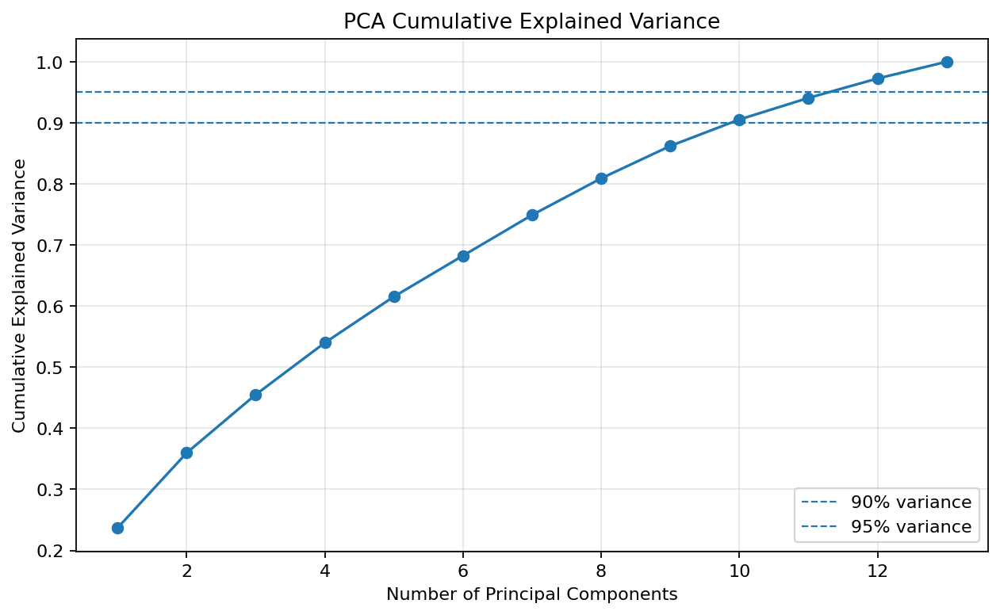
  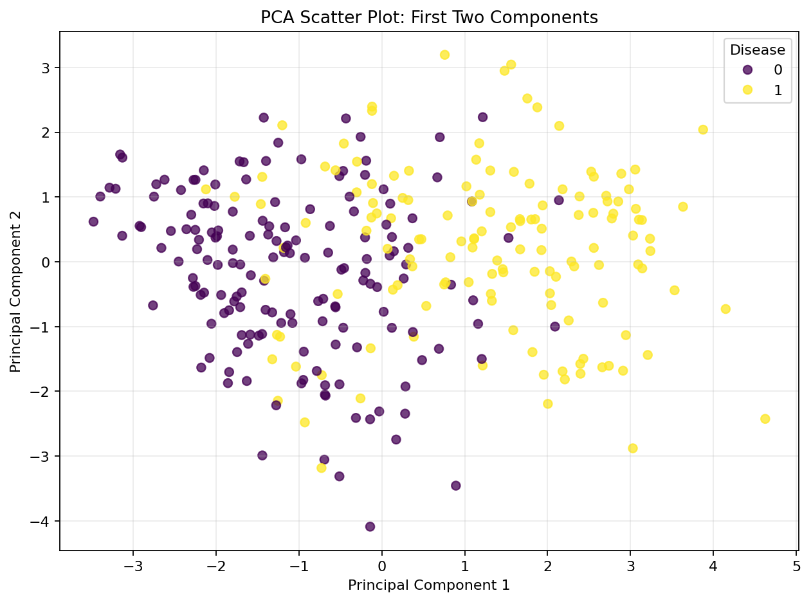
</p>

<p align="center">
  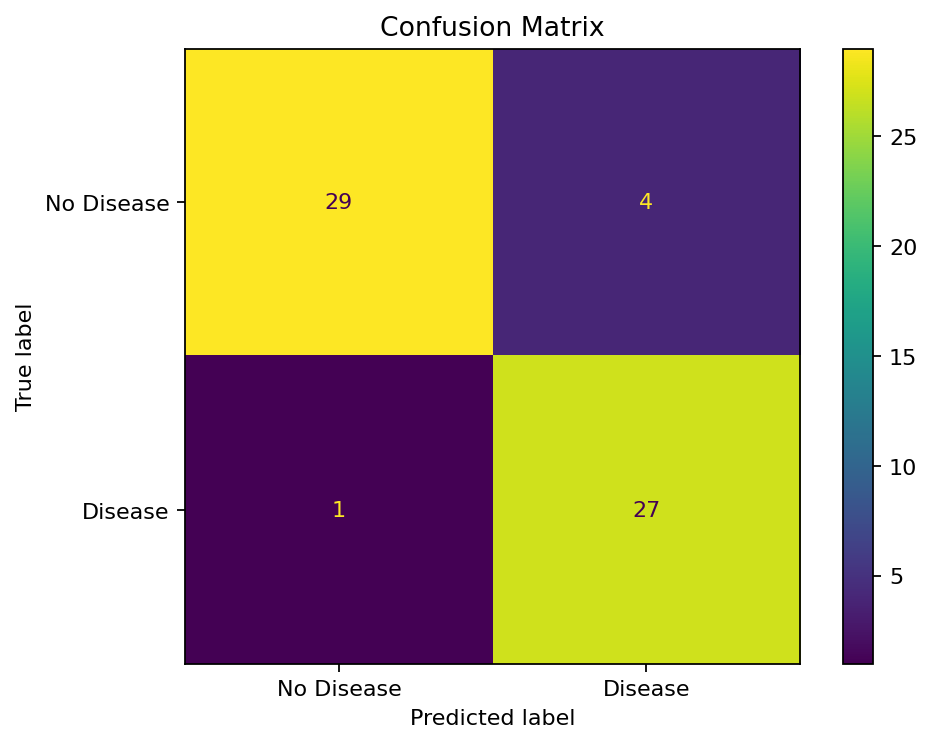
  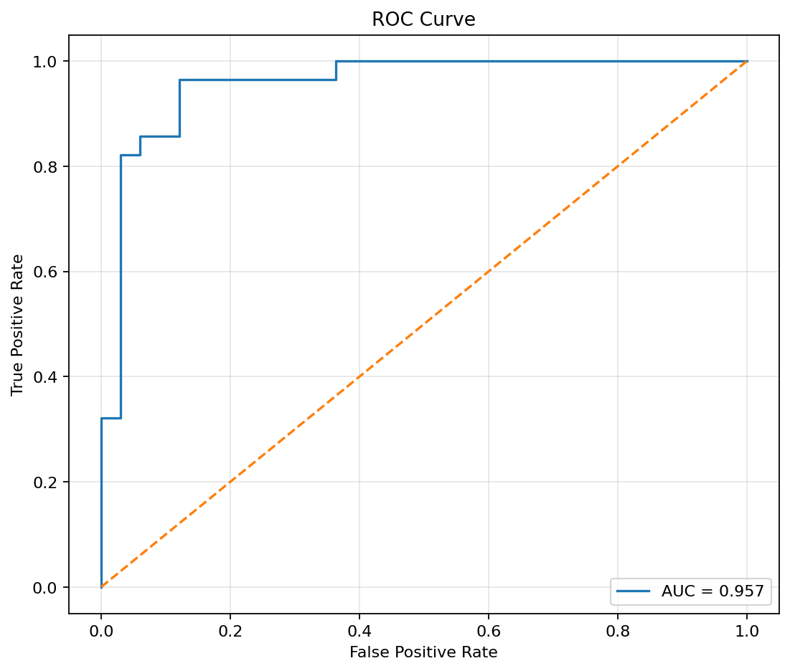
</p>

<p align="center">
  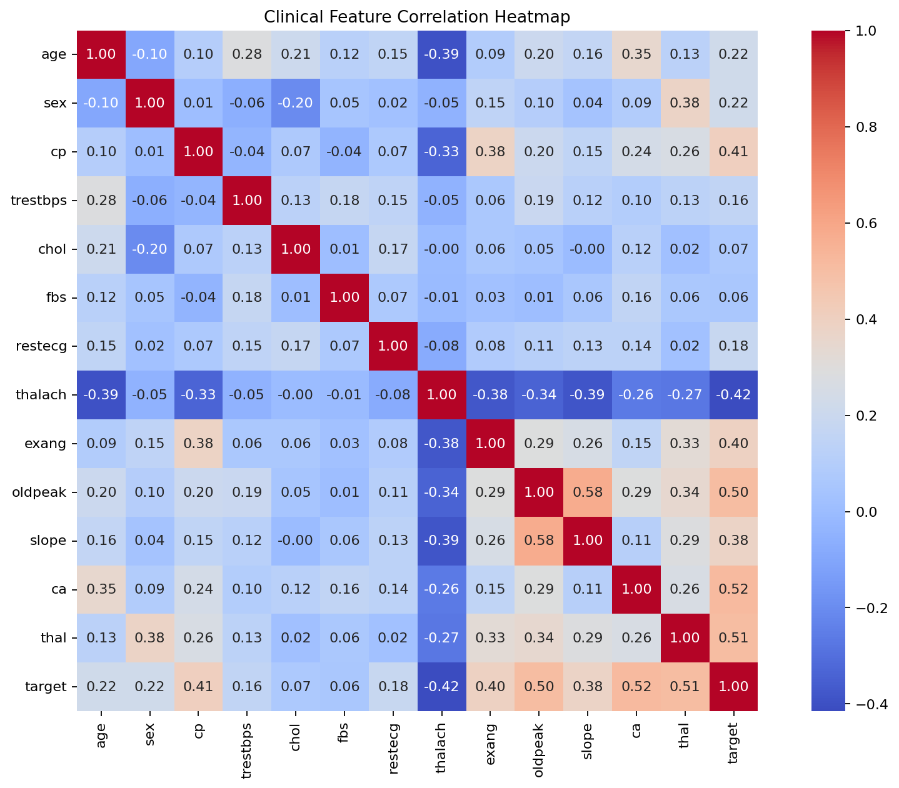
  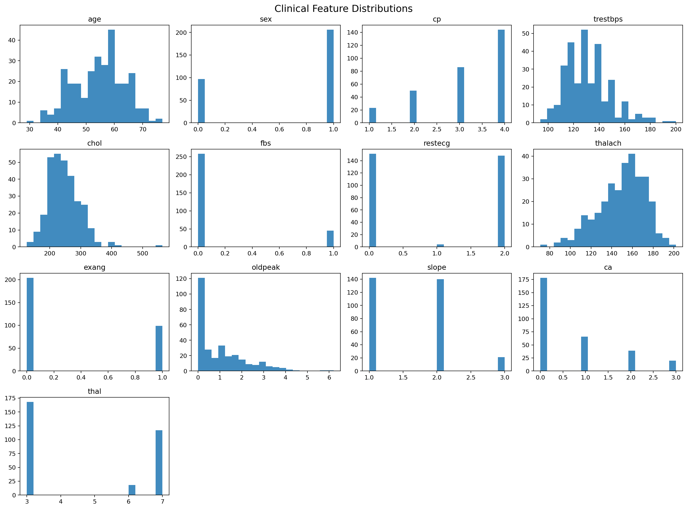
</p>

---

## 🏗️ Architecture

<div align="center">

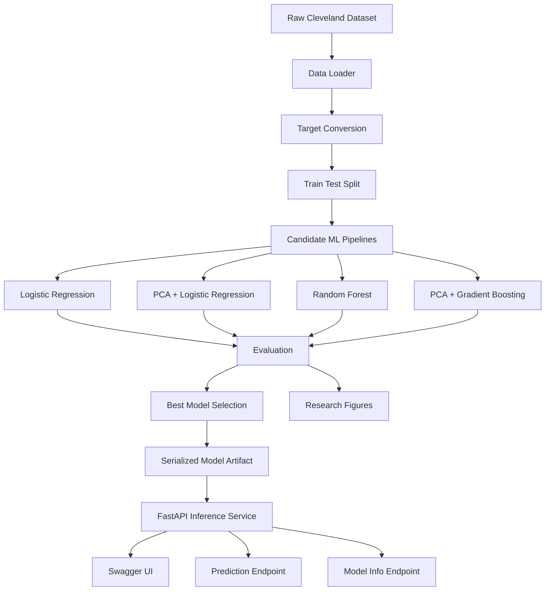

</div>

### 🔄 End-to-End Workflow

```text
Developer Runs Training Script
        ↓
Dataset Is Loaded from data/raw/Cleveland_data.csv
        ↓
Original Target Labels Are Converted to Binary Risk Labels
        ↓
Data Is Split into Train and Test Sets
        ↓
Candidate Pipelines Are Trained and Evaluated
        ↓
Best Model Is Selected by ROC-AUC
        ↓
Model Artifact Is Saved under models/
        ↓
Metrics Are Saved to models/metrics.json
        ↓
Research Figures Are Generated under reports/figures/
        ↓
FastAPI Loads the Model Artifact
        ↓
User Sends a POST Request to /predict
        ↓
API Returns Risk Prediction and Probability
```

### System Flow

| Step |                            What Happens                             |
|------|---------------------------------------------------------------------|
|  1   | Dataset is loaded from the raw data directory                       |
|  2   | Target labels are converted from multiclass severity to binary risk |
|  3   | Features and target are separated                                   |
|  4   | Train/test split is created using stratification                    |
|  5   | Candidate pipelines are trained                                     |
|  6   | Accuracy, precision, recall, F1, and ROC-AUC are calculated         |
|  7   | Best model is serialized as a Joblib artifact                       |
|  8   | Research plots are generated and saved                              |
|  9   | FastAPI exposes model metadata and prediction endpoints             |
|  10  | Swagger UI allows interactive API testing                           |

---

<details>
<summary><strong>📁 Folder Structure</strong></summary>

```text
heart-disease-risk-ml-platform/
├── .github/
│   └── workflows/
│       └── ci.yml
├── .vscode/
│   ├── launch.json
│   ├── settings.json
│   └── tasks.json
├── data/
│   └── raw/
│       └── Cleveland_data.csv
├── docs/
│   └── screenshots/
│       ├── swagger-ui.png
│       ├── prediction-endpoint.png
│       ├── model-info.png
│       ├── model-comparison.png
│       ├── pca-explained-variance.png
│       ├── pca-scatter-plot.png
│       └── confusion-matrix.png
├── models/
│   ├── heart_disease_pipeline.joblib
│   └── metrics.json
├── reports/
│   ├── projectReport.pdf
│   └── figures/
│       ├── correlation-heatmap.png
│       ├── feature-distributions.png
│       ├── boxplots-by-target.png
│       ├── age-group-target-distribution.png
│       ├── chest-pain-target-distribution.png
│       ├── age-vs-thalach.png
│       ├── pca-explained-variance.png
│       ├── scree-plot.png
│       ├── pca-scatter-plot.png
│       ├── model-comparison.png
│       ├── confusion-matrix.png
│       └── roc-curve.png
├── scripts/
│   ├── run_api.py
│   ├── smoke_predict.py
│   └── train_model.py
├── src/
│   └── heart_disease_pca/
│       ├── __init__.py
│       ├── api.py
│       ├── config.py
│       ├── data_loader.py
│       ├── predict.py
│       ├── preprocessing.py
│       ├── train.py
│       └── visualizations.py
├── tests/
│   ├── test_api.py
│   ├── test_data_loader.py
│   └── test_training.py
├── Dockerfile
├── docker-compose.yml
├── LICENSE
├── pyproject.toml
├── README.md
└── requirements.txt
```

</details>

---

## ⚡ Quick Start

### Prerequisites

| Requirement |       Version      |
|-------------|--------------------|
| Python      | 3.10+              |
| pip         | Latest recommended |
| Git         | Any recent version |
| Docker      | Optional           |
| VS Code     | Recommended        |

### Clone Repository

```bash
git clone https://github.com/TaranjyotS/heart-disease-risk-ml-platform.git
cd heart-disease-risk-ml-platform
```

### Create Virtual Environment

```bash
python -m venv .venv
```

### Activate Virtual Environment

Windows PowerShell:

```powershell
.\.venv\Scripts\Activate.ps1
```

Windows Git Bash:

```bash
source .venv/Scripts/activate
```

macOS / Linux:

```bash
source .venv/bin/activate
```

### Install Dependencies

```bash
pip install -r requirements.txt
```

### Install Package in Editable Mode

```bash
pip install -e .
```

This step is important because the project uses a package-based `src/` layout. It prevents import errors such as:

```text
ModuleNotFoundError: No module named 'heart_disease_pca'
```

### Train Model and Generate Figures

```bash
python scripts/train_model.py
```

This creates or updates:

```text
models/heart_disease_pipeline.joblib
models/metrics.json
reports/figures/*.png
```

### Run API

```bash
python scripts/run_api.py
```

Open:

```text
http://localhost:8000/docs
```

### Smoke Test Prediction

```bash
python scripts/smoke_predict.py
```

---

## 🐳 Run with Docker

```bash
docker compose up --build
```

Open:

```text
http://localhost:8000/docs
```

Stop containers:

```bash
docker compose down
```

---

## 🔌 API Reference

### Health Check

```http
GET /health
```

Example response:

```json
{
  "status": "ok"
}
```

### Model Information

```http
GET /model-info
```

Returns the current training objective, selected model, candidate model metrics, feature names, and generated figure references.

### Predict Heart Disease Risk

```http
POST /predict
```

Example request:

```json
{
  "age": 63,
  "sex": 1,
  "cp": 1,
  "trestbps": 145,
  "chol": 233,
  "fbs": 1,
  "restecg": 2,
  "thalach": 150,
  "exang": 0,
  "oldpeak": 2.3,
  "slope": 3,
  "ca": 0,
  "thal": 6
}
```

Example response:

```json
{
  "prediction": 0,
  "risk_probability": 0.1788,
  "label": "no_heart_disease_risk_detected",
  "note": "Educational ML demo only; not a clinical diagnosis."
}
```

---

## 🧪 What This Project Demonstrates

|       Skill Area       |                      Demonstrated Through                         |
|------------------------|-------------------------------------------------------------------|
| Machine Learning       | PCA, Logistic Regression, Random Forest, Gradient Boosting        |
| Data Science           | EDA, correlation analysis, PCA plots, ROC curve, confusion matrix |
| Backend Engineering    | FastAPI endpoints, Pydantic request validation, Swagger UI        |
| Python Engineering     | Package-based `src/` layout, reusable modules, scripts            |
| Testing                | Pytest test suite for data loading, training, and API behavior    |
| DevOps                 | Docker, Docker Compose, GitHub Actions CI                         |
| Production Thinking    | Serialized model artifacts, metrics JSON, reproducible commands   |
| Portfolio Storytelling | Preserved academic report plus upgraded platform architecture     |

---

## 🧰 Troubleshooting

<details>
<summary><strong>ModuleNotFoundError: No module named 'heart_disease_pca'</strong></summary>

Install the package in editable mode:

```bash
pip install -e .
```

Avoid running package modules directly like this:

```bash
python src/heart_disease_pca/train.py
```

Use the provided scripts instead:

```bash
python scripts/train_model.py
python scripts/run_api.py
```

</details>

<details>
<summary><strong>make: command not found</strong></summary>

Windows does not include GNU Make by default.

Use the VS Code-friendly scripts instead:

```bash
python scripts/train_model.py
python scripts/run_api.py
python -m pytest -q
```

</details>

<details>
<summary><strong>405 Method Not Allowed on /predict</strong></summary>

The prediction endpoint supports POST requests only.

This will fail:

```http
GET /predict
```

Use Swagger UI instead:

```text
http://localhost:8000/docs
```

Then execute:

```http
POST /predict
```

</details>

<details>
<summary><strong>Uvicorn appears stuck after startup</strong></summary>

That is expected. The API server is running and waiting for requests.

Open:

```text
http://localhost:8000/docs
```

Stop the server with:

```text
Ctrl + C
```

</details>

<details>
<summary><strong>Figures are not showing in README</strong></summary>

Regenerate training artifacts and plots:

```bash
python scripts/train_model.py
```

Confirm files exist under:

```text
reports/figures/
docs/screenshots/
```

Also make sure file names match exactly, including lowercase spelling and hyphens.

</details>

---

## 🔄 Recommended Clean Rebuild

```bash
python -m venv .venv
.\.venv\Scripts\Activate.ps1
pip install -r requirements.txt
pip install -e .
python scripts/train_model.py
python -m pytest -q
python scripts/run_api.py
```

Open:

```text
http://localhost:8000/docs
```

---

## 🗺️ Roadmap

| Priority |                 Improvement                 |
|----------|---------------------------------------------|
|   High   | Add SHAP-based model explainability         |
|   High   | Add MLflow experiment tracking              |
|   High   | Add model registry workflow                 |
|  Medium  | Add Streamlit or React dashboard            |
|  Medium  | Add batch prediction endpoint               |
|  Medium  | Add data validation with Great Expectations |
|  Medium  | Add API authentication for deployed usage   |
|   Low    | Add Kubernetes manifests                    |
|   Low    | Add cloud deployment templates              |
|   Low    | Add Grafana-style monitoring dashboard      |

---

## 📄 License

This project is licensed under the [MIT License](LICENSE).

---

## ⚠️ Disclaimer

This project is for educational, academic, and portfolio demonstration purposes only.

The predictions generated by this system are not medical advice, are not clinically validated, and must not be used for diagnosis or treatment decisions.

</div>
